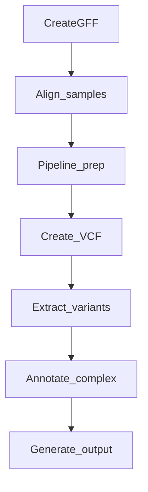

# RAVA: Reference-based Analysis of Viral Alleles

RAVA is derived from LAVA, but for nonlongitudinal sequence data. RAVA takes FASTQ files (for every sample in your analysis), a metadata sheet (providing info on what day or passage each sample was collected), and a reference genome either by accession number or your own FASTA and GFF. Output will be displayed as an interactive graph in your web browser, and a table of all mutations of all samples.

# Table of Contents
- [RAVA: Reference-based Analysis of Viral Alleles](#rava-reference-based-analysis-of-viral-alleles)
- [Table of Contents](#table-of-contents)
  - [Installation](#installation)
    - [Metadata](#metadata)
    - [Reference](#reference)
  - [Options](#options)
    - [Commands](#commands)
  - [Workflow](#workflow)
  - [Example](#example)
  - [Output](#output)
  - [Reformating Genbank File](#reformating-genbank-file)
  - [GFF Creation Guide](#gff-creation-guide)

## Installation

1. Install [nextflow](https://www.nextflow.io/docs/latest/getstarted.html#installation).
   - Make sure you move nextflow to a directory in your PATH variable.
2. Install [docker](https://docs.docker.com/get-docker/). The first time running this program will take a while, as the docker image will take some time to build, but this is a one time thing!
3. If running on the cloud setup [nextflow tower](https://seqera.io/)

### Metadata

The input metadata file has only two inputs required
> Sample: Name of fastq and path if not in current directory
> 
> Passage: Sample name to be displayed on html

> [!WARNING]
> Passage cannot only contain a number for the name, it must have letters or characters to be recognized as a string or the final visualization will not generate.


| Sample |	Passage |
| --- | --- |
Example_fastq/SRR24099553.fastq |	SRR24099553
Example_fastq/SRR24099554.fastq	| SRR24099554

### Reference

RAVA accepts reference input as .gff, .gb or .gbk (Genbank Annotation) or Genbank accession

If GFF or GBK is used as input they are both passed into `--GFF` and require a fasta input `--FASTA`

> [!IMPORTANT]
> It is strongly recommended to use GBK as your input as is easiest to format

| File | Notes | 
| --- | --- |
| .gff |  If GFF is chosen as input please see the GFF [reformating guide](#GFF-Creation-Guide) as a standard GFF file is not accepted as input. A fasta file is required for input. |
| Genbank Accession | If a genbank accession is passed in use `--GENBANK` instead of `--GFF`, `--FASTA` is not required  |
| .gb or .gbk| Use `--GFF` as input for your .gb file, a fasta file is required through `--FASTA`. A genbank file can be downloaded from NCBI or exported from Geneious. If exporting from Geneious click on an annotated fasta and export as .gbk file|

> [!WARNING]
> Genbank files may need to be reformated as CDS is the only input accepted in the pipeline for the protein to be recognized. See reformating Genbank file see [Reformating Genbank File](#Reformating-Genbank-File). 


## Options

| Command  | Description |
| ---      | ---         | 
| `--METADATA` | Input metadata CSV |
| `--OUTDIR` | Output directory |   
| `--FASTA` | Specify a reference fasta to map samples to. This must be the same fasta as your annotation file (.gb or .gff). This option must be used with the `--GFF` flag to specify the protein annotations relative to the start of this fasta. REQUIRED IF NOT `--GENBANK` |
| `--GFF`  |       Specify a reference gff, gb or gbk file with the protein annotations for the reference fasta supplied with the `--FASTA` flag. This option must be paired with the `--FASTA` flag. REQUIRED IF NOT `--GENBANK` |
| `--GENBANK` | Provide a Genbank accession number to use as reference annotation and fasta. REQUIRED IF NOT `--FASTA` + `--GFF` |
| `--ALLELE_FREQ` |  Optional flag, Specify an allele frequency percentage to cut off - with a minimum of 1 percent - in whole numbers. |       
| `--DEDUPLICATE` | Optional flag, will perform automatic removal of PCR duplicates via DeDup. |
| `-resume`  | nextflow will pick up where it left off if the previous command was interrupted for some reason. |
| `-with-docker ubuntu:18.04` | Runs command with Ubuntu docker.
| `-with-trace` | Outputs a trace.txt that shows which processes end up in which work/ folders. 
|`-profile`|`standard`: For less computationally intensive systems run locally, not reccommended
||`MORE`: For running on the more computationally strong local systems, used for lab i9 imacs 
||`Cloud`: For running on the cloud adds more computational power
|`-c`|Add you nextflow config file to access cloud
|`-with-tower`|Monitor your run with nextflow tower 

### Commands

Run locally with standard profile with .gb file

```
nextflow run main.nf \
--OUTDIR example_output/ \
--GFF Examples/Example.gb \
--FASTA Examples/Example.fasta \
--METADATA Examples/Example_metadata.csv \
-with-docker ubuntu:18.04 \
-profile standard
```

Run on cloud with .gff file

```
nextflow run main.nf \
--OUTDIR example_output/ \
--GFF Examples/Example.gff \
--FASTA Examples/Example.fasta \
--METADATA Examples/Example_metadata.csv \
-with-docker ubuntu:18.04 \
-profile Cloud \
-c your_nextflow_aws.config \
-with-tower 
```

Run locally with more computational power and genbank accession.

```
nextflow run main.nf \
--OUTDIR example_output/ \
--GENBANK MF795094 \
--METADATA Examples/Example_metadata.csv \
-with-docker ubuntu:18.04 \
-profile More
```

## Workflow



## Example

Install [sratoolkit](https://github.com/ncbi/sra-tools/wiki/02.-Installing-SRA-Toolkit)

On Mac you can use brew:
```bash
brew install sratoolkit
```

Make an _Example_fastq_ folder

```bash
mkdir Example_fastq
```

Enter _Example_fastq_ folder
```bash
cd Example_fastq
```

Download samples from SRA and place them in the _Example_fastq_ folder.

```bash
fasterq-dump --split-files SRR24099553
fasterq-dump --split-files SRR24099554	
```

Cat R1 and R2 samples together

```bash
for i in *_1.fastq
do
base=$(basename $i _1.fastq)
cat ${base}_1.fastq ${base}_2.fastq > ${base}.fastq
done
```

Remove unpaired reads
```bash
rm *_1.fastq
rm *_2.fastq
```

Exit folder 
```bash
cd ..
```

Run example workflow or use one from above

> With gb file

```
nextflow run main.nf --OUTDIR example_output/ --GFF Examples/Example.gb --FASTA Examples/Example.fasta   --METADATA Examples/Example_metadata.csv  -with-docker ubuntu:18.04 -profile standard 
```

> With gff file

```
nextflow run main.nf --OUTDIR example_output/ --GFF Examples/Example.gff --FASTA Examples/Example.fasta   --METADATA Examples/Example_metadata.csv  -with-docker ubuntu:18.04 -profile standard 
```

> With genbank accession

```
nextflow run main.nf --OUTDIR example_output/ --GENBANK MF795094 --METADATA Examples/Example_metadata.csv  -with-docker ubuntu:18.04 -profile standard
```

## Output
```
example_output
├── RAVA_plots.html                     # Rava html visualization file open in browser
├── all_files
│   ├── mat_peptides_additions.txt      # If mature peptides are included in annotation they are listed here
│   └── ribosomal_start.txt             # First peptide
├── bam_files
│   ├── SRR24099553.fastq.bam           # bam file from alignment to reference file
│   └── SRR24099554.fastq.bam
├── complex.log                         # Complex annotations are listed here if there are any
├── genomecov                           
│   ├── SRR24099553.fastq.genomecov     # genome coverage file for sample
│   └── SRR24099554.fastq.genomecov
├── reads.csv                           # reads stats file
├── vcf_files
│   ├── SRR24099553.fastq.vcf           # vcf for sample
│   └── SRR24099554.fastq.vcf
└── visualization.csv                   # csv used to generate visualization, shows all annotated mutations
```

## Reformating Genbank File

Sometime a virus will have a large polyprotein. For a genbank file this will be labeled as a CDS and all other proteins will be labeled as mat_peptide.

This will produce an output visualization where the polyprotein is the only ORF annotated and mature peptides are green arrows.

It is recommended to rename the large polyprotein to anything other than CDS and rename the mature peptides to CDS for them to display with labels.

From
```
LOCUS       AB016162               15894 bp    RNA     linear   VRL 21-SEP-2000
DEFINITION  Measles virus genomic RNA, complete sequence.
ACCESSION   AB016162
VERSION     AB016162.1
KEYWORDS    nonstructural C protein; L; large polymerase; H; hemagglutinin
            protein; F; fusion protein; M; matrix protein; C; P;
            phosphoprotein; N; nucleocapsid protein.
SOURCE      Measles morbillivirus
  ORGANISM  Measles morbillivirus
            Viruses; Riboviria; Orthornavirae; Negarnaviricota;
            Haploviricotina; Monjiviricetes; Mononegavirales; Paramyxoviridae;
            Orthoparamyxovirinae; Morbillivirus; Morbillivirus hominis.
REFERENCE   1
  AUTHORS   Takeuchi,K., Miyajima,N., Kobune,F. and Tashiro,M.
  TITLE     Comparative nucleotide sequence analyses of the entire genomes of
            B95a cell-isolated and vero cell-isolated measles viruses from the
            same patient
  JOURNAL   Virus Genes 20 (3), 253-257 (2000)
   PUBMED   10949953
REFERENCE   2  (bases 1 to 15894)
  AUTHORS   Takeuchi,K., Tanabayashi,K. and Tashiro,M.
  TITLE     Direct Submission
  JOURNAL   Submitted (10-JUL-1998) Kaoru Takeuchi, National Institute of
            Infectious Diseases, Viral Disease and Vaccine Contorol; 4-7-1
            Gakuen, Musashi-murayama, Tokyo 208-0011, Japan
            (E-mail:ktake@nih.go.jp, Tel:81-42-561-0771(ex.530),
            Fax:81-42-567-5631)
COMMENT     On Dec 14, 1998 this sequence version replaced gi:3986256.
            Sequence updated (21-Jul-1998)
            Sequence updated (11-Dec-1998).
FEATURES             Location/Qualifiers
     CDS          1..15894
                     /organism="Measles morbillivirus"
                     /mol_type="genomic RNA"
                     /strain="Ichinose-B95a"
                     /db_xref="taxon:11234"
     gene            108..1685
                     /gene="N"
     mat_peptide     108..1685
                     /gene="N"
                     /codon_start=1
                     /product="nucleocapsid protein"
                     /protein_id="BAA34977.1"
                     /translation="MATLLRSLALFKRNKDKPPITSGSGGAIRGIKHIIIVPIPGDSS
                     ITTRSRLLDRLVRLIGNPDVSGPKLTGALIGILSLFVESPGQLIQRITDDPDVSIRLL
                     EVVQSDQSQSGLTFASRGTNMEDEADQYFSHDDPSSSDQSRSGWFENKEISDIEVQDP
                     EGFNMILGTILAQIWVLLAKAVTAPDTAADSELRRWIKYTQQRRVVGEFRLERKWLDV
                     VRNRIAEDLSLRRFMVALILDIKRTPGNKPRIAEMICDIDTYIVEAGLASFILTIKFG
                     IETMYPALGLHEFAGELSTLESLMNLYQQMGETAPYMVILENSIQNKFSAGSYPLLWS
                     YAMGVGVELENSMGGLNFGRSYFDPAYFRLGQEMVRRSAGKVSSTLASELGITAEDAR
                     LVSEIAMHTTEDRISRAVGPRQAQVSFLHGDQSENELPGLGGKEDRRVKQGRGEARES
                     YRETGSSRASDARAAHPPTSMPLDIDTASESGQDPQDSRRSADALLRLQAMAGILEEQ
                     GSDTDTPRVYNDRDLLD"
     gene            1807..3330
                     /gene="P"
     mat_peptide     1807..3330
                     /gene="P"
                     /note="additional G insertion at 2499:V mRNA"
                     /codon_start=1
                     /product="phosphoprotein"
                     /protein_id="BAA34978.1"
                     /translation="MAEEQARHVKNGLECIRALKAEPIGSLAVEEAMAAWSEISDNPG
                     QDRATCKEEEAGSSGLSKPCLSAIGSTEGGAPRIRGQGSGESDDDAETLGIPSRNLQA
                     SSTGLQCYHVYDHSGEAVKGIQDADSIMVQSGLDGDSTLSGGDDESENSDVDIGEPDT
                     EGYAITDRGSAPISMGFRASDVETAEGGEIHELLKLQSRGNNFPKLGKTLNVPPPPNP
                     SRASTSETPIKKGTDARLASFGTEIASLLTGGATQCARKSPSEPSGPGAPAGNVPECV
                     SNAALIQEWTPESGTTISPRSQNNEEGGDYYDDELFSDVQDIKTALAKIHEDNQKIIS
                     KLESLLLLKGEVESIKKQINRQNISISTLEGHLSSIMIAIPGLGKDPNDPTADVELNP
                     DLKPIIGRDSGRALAEVLKKPVASRQLQGMTNGRTSSRGQLLKEFQLKPIGKKVSSAV
                     GFVPDTGPASRSVIRSIIKSSRLEEDRKRYLMTLLDDIKGANDLAKFHQMLMKIIMK"
     mat_peptide     1829..2389
                     /gene="P"
                     /codon_start=1
                     /product="nonstructural C protein"
                     /protein_id="BAA34979.1"
                     /translation="MSKTDWNASGLSRPSPSAHWPSRKPWQHGQKYQTTQDRTEPPAR
                     KRRQAVRVSANHASQQLDQLKAVHLASAVRDLEKAMTTLKLWESPQEISRHQALGYSV
                     IMFMITAVKRLRESKMLTLSWFNQALMVIAPSQEETMNLKTAMWILANLIPRDMLSLT
                     GDLLPSLWGSGLLMLKLQKEGRSTSS"
     gene            3438..4445
                     /gene="M"
     mat_peptide     3438..4445
                     /gene="M"
                     /codon_start=1
                     /product="matrix protein"
                     /protein_id="BAA34980.1"
                     /translation="MTEIYDFDKSAWDIKGSIAPIQPTTYSDGRLVPQVRVIDPGLGD
                     RKDECFMYMFLLGVVEDSDPLGPPIGRAFGSLPLGVGRSTAKPEELLKEATELDIVVR
                     RTAGLNEKLVFYNNTPLTLLTPWRKVLTTGSVFNANQVCNAVNLIPLDTPQRFRVVYM
                     SITRLSDNGYYTVPRRMLEFRSVNAVAFNLLVTLRIDKAIGPGKIIDNAEQLPEATFM
                     VHIGNFRRKKSEVYSADYCKMKIEKMGLVFALGGIGGTSLHIRSTGKMSKTLHAQLGF
                     KKTLCYPLMDINEDLNRLLWRSRCKIVRIQAVLQPSVPQEFRIYDDVIINDDQGLFKV
                     L"
     gene            5458..7110
                     /gene="F"
     mat_peptide     5458..7110
                     /gene="F"
                     /note="additional G inserted at 2499:V"
                     /codon_start=1
                     /product="fusion protein"
                     /protein_id="BAA34981.1"
                     /translation="MGLKVNVSAIFMAVLLTLQTPTGQIHWGNLSKIGVVGIGSASYK
                     VMTRSSHQSLVIKLMPNITLLNNCTRVEIAEYRRLLRTVLEPIRDALNAMTQNIRPVQ
                     SVASSRRHKRFAGVVLAGAALGVATAAQITAGIALHQSMLNSQAIDNLRASLETTNQA
                     IEAIRQAGQEMILAVQGVQDYINNELIPSMNQLSCDLIGQKLGLKLLRYYTEILSLFG
                     PSLRDPISAEISIQALSYALGGDINKVLEKLGYSGGDLLGILESRGIKARITHVDTES
                     YFIVLSIAYPTLSEIKGVIVHRLEGVSYNIGSQEWYTTVPKYVATQGYLISNFDESSC
                     TFMPEGTVCSQNALYPMSPLLQECLRGSTKSCARTLVSGSFGNRFILSQGNLIANCAS
                     ILCKCYTTGTIINQDPDKILTYIAADHCPVVEVNGVTIQVGSRRYPDAVYLHRIDLGP
                     PISLERLDVGTNLGNAIAKLEDAKELLESSDQILRSMKGLSSTSIVYILIAVCLGGLI
                     GIPALICCCRGRCNKKGEQVGMSRPGLKPDLTGTSKSYVRSL"
```

To
```
LOCUS       AB016162               15894 bp    RNA     linear   VRL 21-SEP-2000
DEFINITION  Measles virus genomic RNA, complete sequence.
ACCESSION   AB016162
VERSION     AB016162.1
KEYWORDS    nonstructural C protein; L; large polymerase; H; hemagglutinin
            protein; F; fusion protein; M; matrix protein; C; P;
            phosphoprotein; N; nucleocapsid protein.
SOURCE      Measles morbillivirus
  ORGANISM  Measles morbillivirus
            Viruses; Riboviria; Orthornavirae; Negarnaviricota;
            Haploviricotina; Monjiviricetes; Mononegavirales; Paramyxoviridae;
            Orthoparamyxovirinae; Morbillivirus; Morbillivirus hominis.
REFERENCE   1
  AUTHORS   Takeuchi,K., Miyajima,N., Kobune,F. and Tashiro,M.
  TITLE     Comparative nucleotide sequence analyses of the entire genomes of
            B95a cell-isolated and vero cell-isolated measles viruses from the
            same patient
  JOURNAL   Virus Genes 20 (3), 253-257 (2000)
   PUBMED   10949953
REFERENCE   2  (bases 1 to 15894)
  AUTHORS   Takeuchi,K., Tanabayashi,K. and Tashiro,M.
  TITLE     Direct Submission
  JOURNAL   Submitted (10-JUL-1998) Kaoru Takeuchi, National Institute of
            Infectious Diseases, Viral Disease and Vaccine Contorol; 4-7-1
            Gakuen, Musashi-murayama, Tokyo 208-0011, Japan
            (E-mail:ktake@nih.go.jp, Tel:81-42-561-0771(ex.530),
            Fax:81-42-567-5631)
COMMENT     On Dec 14, 1998 this sequence version replaced gi:3986256.
            Sequence updated (21-Jul-1998)
            Sequence updated (11-Dec-1998).
FEATURES             Location/Qualifiers
     source          1..15894
                     /organism="Measles morbillivirus"
                     /mol_type="genomic RNA"
                     /strain="Ichinose-B95a"
                     /db_xref="taxon:11234"
     gene            108..1685
                     /gene="N"
     CDS             108..1685
                     /gene="N"
                     /codon_start=1
                     /product="nucleocapsid protein"
                     /protein_id="BAA34977.1"
                     /translation="MATLLRSLALFKRNKDKPPITSGSGGAIRGIKHIIIVPIPGDSS
                     ITTRSRLLDRLVRLIGNPDVSGPKLTGALIGILSLFVESPGQLIQRITDDPDVSIRLL
                     EVVQSDQSQSGLTFASRGTNMEDEADQYFSHDDPSSSDQSRSGWFENKEISDIEVQDP
                     EGFNMILGTILAQIWVLLAKAVTAPDTAADSELRRWIKYTQQRRVVGEFRLERKWLDV
                     VRNRIAEDLSLRRFMVALILDIKRTPGNKPRIAEMICDIDTYIVEAGLASFILTIKFG
                     IETMYPALGLHEFAGELSTLESLMNLYQQMGETAPYMVILENSIQNKFSAGSYPLLWS
                     YAMGVGVELENSMGGLNFGRSYFDPAYFRLGQEMVRRSAGKVSSTLASELGITAEDAR
                     LVSEIAMHTTEDRISRAVGPRQAQVSFLHGDQSENELPGLGGKEDRRVKQGRGEARES
                     YRETGSSRASDARAAHPPTSMPLDIDTASESGQDPQDSRRSADALLRLQAMAGILEEQ
                     GSDTDTPRVYNDRDLLD"
     gene            1807..3330
                     /gene="P"
     CDS             1807..3330
                     /gene="P"
                     /note="additional G insertion at 2499:V mRNA"
                     /codon_start=1
                     /product="phosphoprotein"
                     /protein_id="BAA34978.1"
                     /translation="MAEEQARHVKNGLECIRALKAEPIGSLAVEEAMAAWSEISDNPG
                     QDRATCKEEEAGSSGLSKPCLSAIGSTEGGAPRIRGQGSGESDDDAETLGIPSRNLQA
                     SSTGLQCYHVYDHSGEAVKGIQDADSIMVQSGLDGDSTLSGGDDESENSDVDIGEPDT
                     EGYAITDRGSAPISMGFRASDVETAEGGEIHELLKLQSRGNNFPKLGKTLNVPPPPNP
                     SRASTSETPIKKGTDARLASFGTEIASLLTGGATQCARKSPSEPSGPGAPAGNVPECV
                     SNAALIQEWTPESGTTISPRSQNNEEGGDYYDDELFSDVQDIKTALAKIHEDNQKIIS
                     KLESLLLLKGEVESIKKQINRQNISISTLEGHLSSIMIAIPGLGKDPNDPTADVELNP
                     DLKPIIGRDSGRALAEVLKKPVASRQLQGMTNGRTSSRGQLLKEFQLKPIGKKVSSAV
                     GFVPDTGPASRSVIRSIIKSSRLEEDRKRYLMTLLDDIKGANDLAKFHQMLMKIIMK"
     CDS             1829..2389
                     /gene="P"
                     /codon_start=1
                     /product="nonstructural C protein"
                     /protein_id="BAA34979.1"
                     /translation="MSKTDWNASGLSRPSPSAHWPSRKPWQHGQKYQTTQDRTEPPAR
                     KRRQAVRVSANHASQQLDQLKAVHLASAVRDLEKAMTTLKLWESPQEISRHQALGYSV
                     IMFMITAVKRLRESKMLTLSWFNQALMVIAPSQEETMNLKTAMWILANLIPRDMLSLT
                     GDLLPSLWGSGLLMLKLQKEGRSTSS"
     gene            3438..4445
                     /gene="M"
     CDS             3438..4445
                     /gene="M"
                     /codon_start=1
                     /product="matrix protein"
                     /protein_id="BAA34980.1"
                     /translation="MTEIYDFDKSAWDIKGSIAPIQPTTYSDGRLVPQVRVIDPGLGD
                     RKDECFMYMFLLGVVEDSDPLGPPIGRAFGSLPLGVGRSTAKPEELLKEATELDIVVR
                     RTAGLNEKLVFYNNTPLTLLTPWRKVLTTGSVFNANQVCNAVNLIPLDTPQRFRVVYM
                     SITRLSDNGYYTVPRRMLEFRSVNAVAFNLLVTLRIDKAIGPGKIIDNAEQLPEATFM
                     VHIGNFRRKKSEVYSADYCKMKIEKMGLVFALGGIGGTSLHIRSTGKMSKTLHAQLGF
                     KKTLCYPLMDINEDLNRLLWRSRCKIVRIQAVLQPSVPQEFRIYDDVIINDDQGLFKV
                     L"
     gene            5458..7110
                     /gene="F"
     CDS             5458..7110
                     /gene="F"
                     /note="additional G inserted at 2499:V"
                     /codon_start=1
                     /product="fusion protein"
                     /protein_id="BAA34981.1"
                     /translation="MGLKVNVSAIFMAVLLTLQTPTGQIHWGNLSKIGVVGIGSASYK
                     VMTRSSHQSLVIKLMPNITLLNNCTRVEIAEYRRLLRTVLEPIRDALNAMTQNIRPVQ
                     SVASSRRHKRFAGVVLAGAALGVATAAQITAGIALHQSMLNSQAIDNLRASLETTNQA
                     IEAIRQAGQEMILAVQGVQDYINNELIPSMNQLSCDLIGQKLGLKLLRYYTEILSLFG
                     PSLRDPISAEISIQALSYALGGDINKVLEKLGYSGGDLLGILESRGIKARITHVDTES
                     YFIVLSIAYPTLSEIKGVIVHRLEGVSYNIGSQEWYTTVPKYVATQGYLISNFDESSC
                     TFMPEGTVCSQNALYPMSPLLQECLRGSTKSCARTLVSGSFGNRFILSQGNLIANCAS
                     ILCKCYTTGTIINQDPDKILTYIAADHCPVVEVNGVTIQVGSRRYPDAVYLHRIDLGP
                     PISLERLDVGTNLGNAIAKLEDAKELLESSDQILRSMKGLSSTSIVYILIAVCLGGLI
                     GIPALICCCRGRCNKKGEQVGMSRPGLKPDLTGTSKSYVRSL"
```
## GFF Creation Guide
Perhaps the most difficult aspect of running this program is properly formatting your reference fasta and .gff files. In order to have a longitudinal analysis that makes sense, you need to specify a fasta file containing the majority consensus for the first sample. This allows you to examine minor variants in your first sample properly. If you use a fasta that is not representative of your first sample RAVA will Genbank many mutations at 100% allele frequency in your first sample. 

In order to avoid this issue, we recommend using the `-q` flag to specify a GenBank record that is a reference for your samples. Assuming the selected reference has accurate annotations, RAVA will automatically assemble a working consensus sequence for your first set of reads and use this as the reference. 

However, for situations that are not covered by GenBank references, you would need to manually generate your own .fasta and .gff files.

**Example: Using the Template GFF**

An example of something that would not be covered by GenBank references, and thus would not be recommended to use the `-q` flag, is if you wanted to analyze all Influenza A segments at once.

In this case you need to use your favorite method of generating a consensus fasta for your first set of reads (we mainly use Geneious). Once this is done you need to make your .gff file. However, ANNOVAR requires a VERY strict formatting of these gff files. 

The easiest way of generating a new gff file is to edit gene/CDS/transcript names and locations in the provided `Example1_ref.gff`. We highly recommend this method to avoid lots of formatting issues.

To do this you first need to have your start and end nucleotide postitions for your protein locations - these must be relative to the start of the provided reference fasta. (So if you're using a reference fasta that you added 200 Ns to the start of the sequence, all protein starts and stops would need to be increased by 200). 

Below is a visual guide of what you need to change the template `Example1_ref.gff` for your purposes.


The color coded regions are the only portions that need to be changed. (The first two lines of the .gff files are comments and can be safely ignored.)

Proteins are coded by 3 tab separated lines (gene, CDS, transcript). 

* The first column must be the name of your .fasta reference sequence. (So if the first line of your reference .fasta is >example, the first column of each row should read `example`. Here, the name is `WSN_reference2`.
* The fourth column should contain your start and end nucleotide positions of protein locations. Change the numbers to match your fasta file. Make sure to keep the blocks of 3, so that there are correct protein locations for each of gene, CDS, transcript.
* The last column has protein names that need to be replaced. Make sure you are replacing after both the `ID=` and the `Parent=`.

**Specific Requirements**

If you don't want to use the template GFF, or want to troubleshoot any problems with the GFF that may be popping up, here are the specific formatting requirements for each column.

| Fasta Name | Source | Feature | Start | End | Score | Strand | Phase | Attributes |
| --- | --- | --- | --- | --- | --- | --- | --- | --- |
| Must match the name of your .fasta reference sequence: both the first line, and the file name. | Anything in this column. | One of 3 things: gene, CDS, transcript. CDS must be in all caps. Each protein MUST have all 3 features. | Beginning position of the protein. | End position of the protein. | Only contains "." | Only contains "+". | Contains a "0" for all CDS lines, and "." for all others. | Contains ID=`feature type`, where `feature type` is one of gene, CDS, or transcript, followed by the protein name. For CDS lines, it must also contain a `Parent=transcript:` identifier, followed by the protein name. For transcript lines, it must also contain a `Parent=gene:` identifier, followed by the protein name. All lines must end with `biotype=protein_coding`. Each of these tags should be separated by semicolons.|

If you experience any difficulties doing this, or have any other questions about RAVA, feel free to email us at uwvirongs@gmail.com and we'll be happy to help you out!